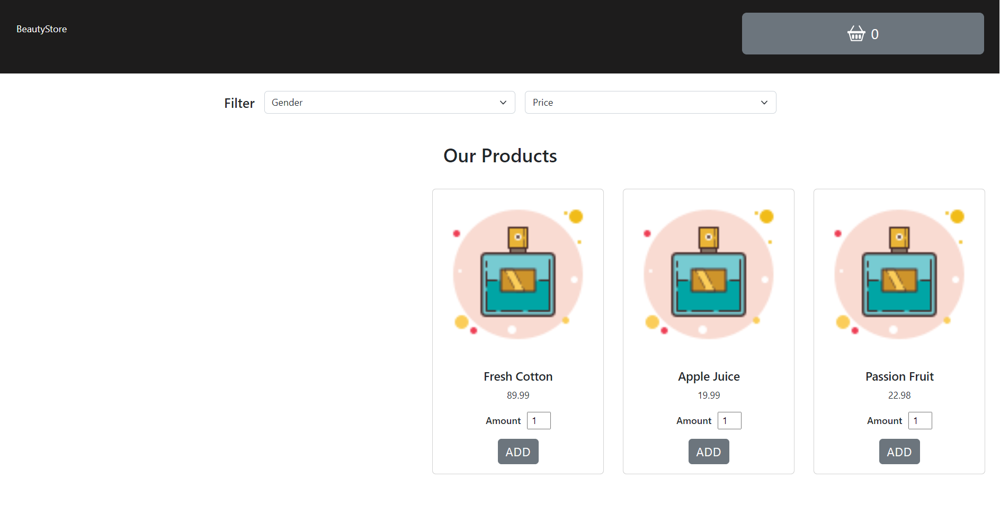

# Beauty store

Beauty's one-page store allows adding chosen products to the cart and checking it in the cart modal.

See [Store]().

## 💡 Technologies

## Install

In the project directory, you can run:

### `npm install`

### `npm start`

Runs the app in the development mode.\
Open [http://localhost:3000](http://localhost:3000) to view it in your browser.

The page will reload when you make changes.\
You may also see any lint errors in the console.

## Development plans

I'd like to create a filter function that should show the choosen element.
